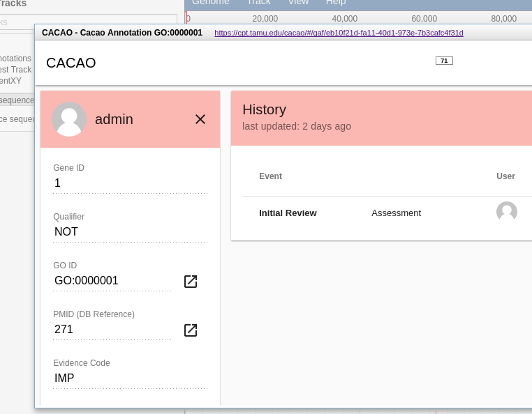
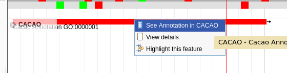
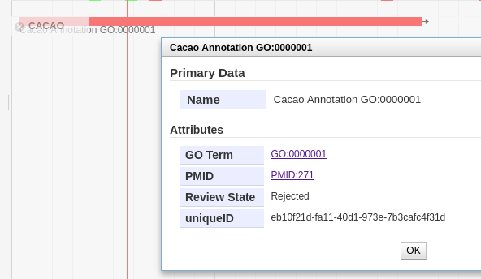

# Apollo CACAO Plugin

A JBrowse plugin for talking to [CACAO](https://github.com/TAMU-CPT/cacao-frontend) servers.
Plugin consists of a storeClass that lightly wraps the default REST.js implementation with
a small change that allows it to function in the context of an Apollo JBrowse environment.



## Example configuration

```json
{
	"storeClass" : "CACAO/Store/SeqFeature/REST",
	"type"       : "CACAO/View/Track/CanvasFeatures",
	"label"      : "CACAO",
	"key"        : "CACAO",
	"baseUrl"    : "https://your-server/cacao-backend/jbrowse/",
}
```

## Showcase

Simplified menu due to restricted CACAO functionality



Simplified details page additionally links to respective GO/PMID entries in CACAO




## Support

This material is based upon work supported by the National Science Foundation under Grant Number (Award 1565146)
